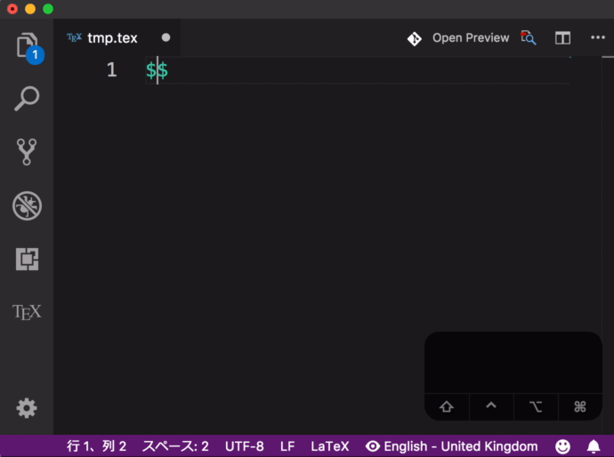
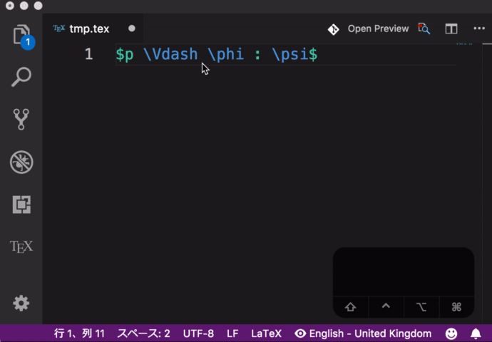
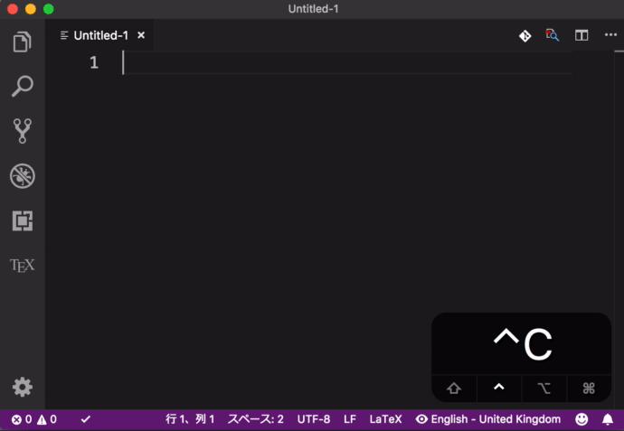
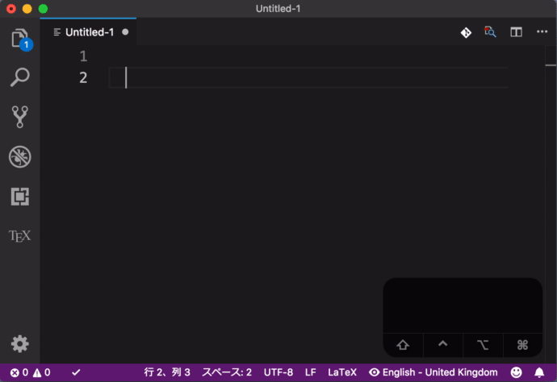
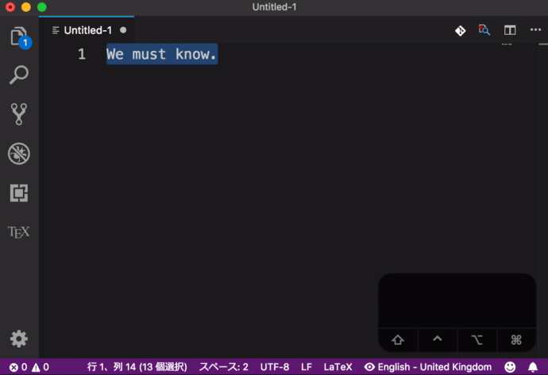
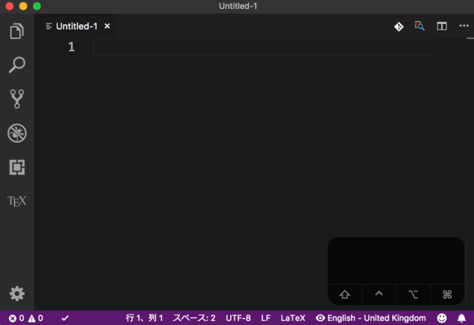
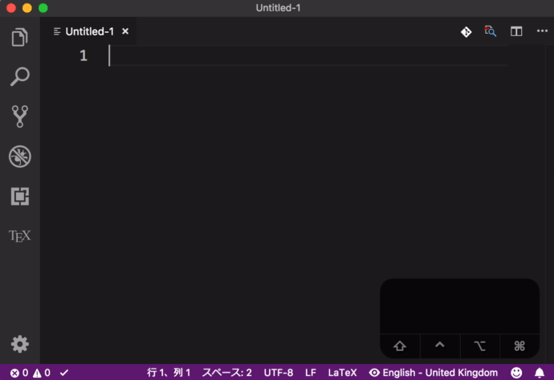
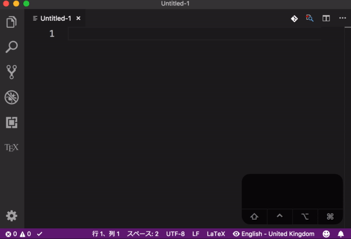

# CaTeX (軽鳥／怪鳥) - YaTeX like completions for LaTeX in VSCode

## Functionalities

- [YaTeX]-like image/greek completion
- Powerful snippet completion for LaTeX commands/environments:
  - `\section{}`-like completion (<kbd>C-c s</kbd>)
  - `\begin{}\end{}`-type completion (<kbd>C-c b</kbd>)
  - `{\Large }`-like completion (<kbd>C-c l</kbd>)
  - `\maketitle`-like completion (<kbd>C-c m</kbd>)
    - In any completion, you can automatically register unknown commands!
- Automatic settings update;
  right after you edit `settings.json` or workspace file,
  other affected editors automatically reflects that change and
  there is no need for reloading or restarting!

[YaTeX]: https://yatex.org

## DEMOs

### Image and Greek Completion

### Image Completion, manually invoked for surrounding

### `\section{}`-completion

Completion and surrounding:

Registration of custom completion, with arg specification:

### `\begin{}\end{}`-type completion

Completion and surrounding:

Registration of custom completion, with arg specification:

### `{\Large }`-type completion

Completion and surrounding

Custom registration, with/out arg specs:

### `\maketitle`-type completion

Completion and registration:

## Recommendation for Other Extension

James Yu's [LaTeX Workshop] extension comes with rich complementary features such as auto-typesetting, SyncTeX support, and jump between corresponding `\begin` and `end`, etc.
Although it collides with the <kbd>@</kbd> completion for math fonts, the author strongly recommend to install LaTeX Workshop as well.
To be honest, CaTeX was designed to fill a gap between LaTeX Workshop and YaTeX.

[LaTeX Workshop]: https://marketplace.visualstudio.com/items?itemName=James-Yu.latex-workshop

## TODOs

- Supports `<>` and `()`-style arguments for commands.
- Prefixed `\begin-\end` completions
- Package name completions
- Contextual completion based on grammatical scopes
- (Unifying dictionaries of snippet completion and image-completions)
